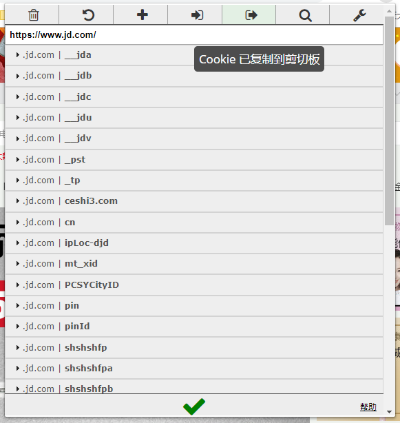
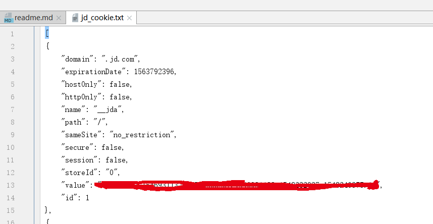
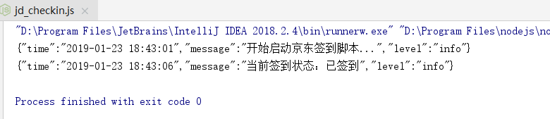

**1.登陆京东，使用 EditThisCookie 导出cookie**

**2.将导出的cookie 粘贴到jd_cookie.txt文件中**

**3. 安装puppeteer，fs，winston，node-datetime**
```jshelllanguage
npm i puppeteer fs winston node-datetime
```
**4.运行脚本**



注意：

**cookie过期后需要重新导入cookie**

Have Fun !